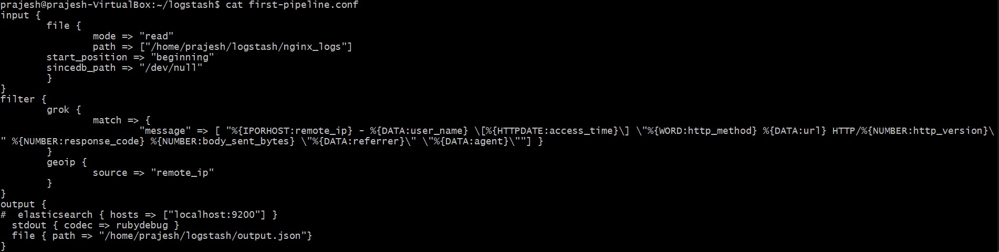

# Question 4

> Install Logstash in your system. download a sample nginx log from https://github.com/elastic/examples/blob/master/Common%20Data%20Formats/nginx_logs/nginx_logs, parse the logs using Logstash. The parsed output must contain the geographical information like country, state etc. that the request is originating from. save the parsed output to a file in your system.

So first to install Logstash use the following commands:

```
~ wget -qO - https://artifacts.elastic.co/GPG-KEY-elasticsearch | sudo apt-key add –
~ sudo apt-get install apt-transport-https
~ echo "deb https://artifacts.elastic.co/packages/7.x/apt stable main" | sudo tee -a /etc/apt/sources.list.d/elastic-7.x.list
~ sudo apt-get update && sudo apt-get install logstash
```

Logstash works with 3 step processes:
- Filter
- Input
- Output

So, to configure these we will need to create a configuration file for parsing the Nginx log sample as given below

```
input {
	file {
     		path => ["/home/prajesh/logstash/nginx_logs"]
        	start_position => "beginning"
 	}
}
filter {
     	grok {
       	match => {
"message" => [ "%{IPORHOST:remote_ip} - %{DATA:user_name} \[%{HTTPDATE:access_time}\] \"%{WORD:http_method} %{DATA:url} HTTP/%{NUMBER:http_version}\" %{NUMBER:response_code} %{NUMBER:body_sent_bytes} \"%{DATA:referrer}\" \"%{DATA:agent}\""] }
   	}
  	geoip {
       	source => "remote_ip"
   	}
}
output {
stdout { codec => rubydebug }
 	file { path => "/home/prajesh/logstash/output.json"}
}
```
 


Input is used to get the log file

Filter is used to apply some operation to the logs, here we used **grok** and **geoip** plugin to parse and get the geographical information from the IP address. 

Output is used to get the output of the parsing from Logstash.


In this way the sample log file is parsed into a Json file with geographical information as given in the screenshot


